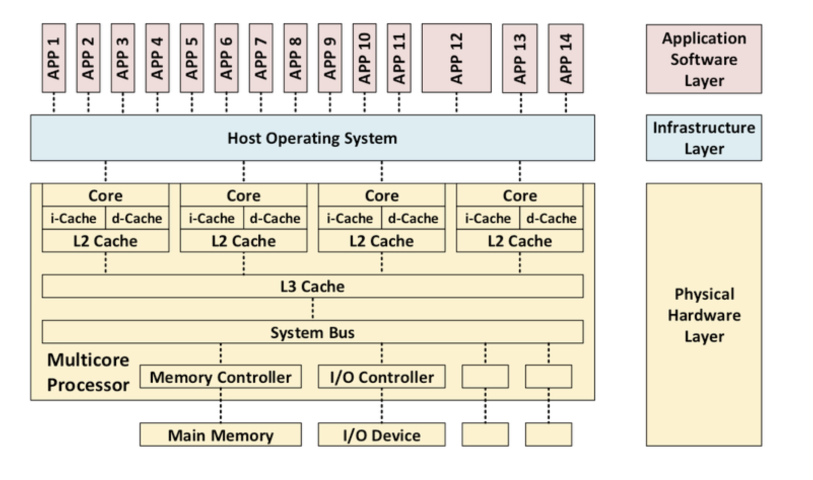
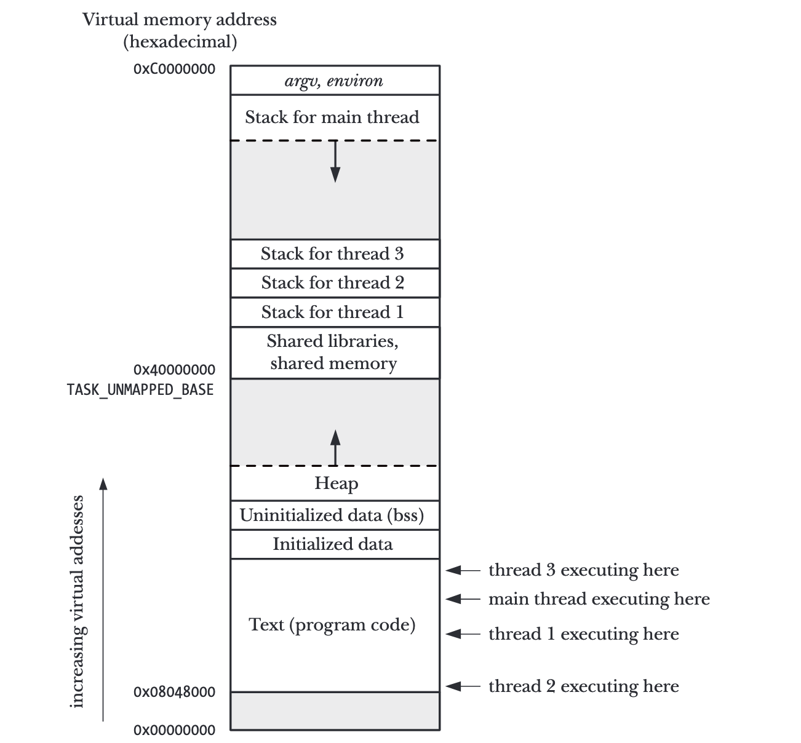
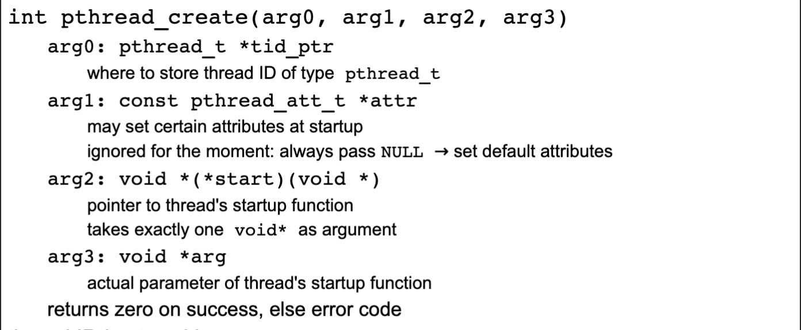
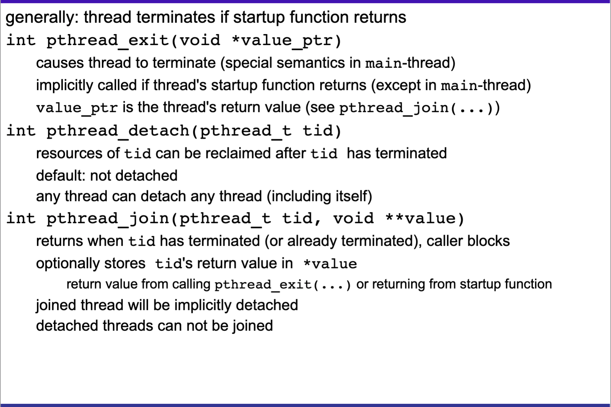

# Philosophers (42's common core project)

### key words
Lock in multi processes system ;Dead lock ;Atomic locking mechanism; Data race;mutexes;semaphores; state variables; Time since last philo ate

## Introduction 
This project is about learning how threads work by precisely timing a group of philosophers on when to pick up forks and eat spaghetti without dying from hunger.
The dining philosphers is an example problem often used in concurrent (The ability of different parts of a program to be executed in a partial order without affecting the final outcome) algorithm design to illustrate synchronization and techniques for resolving them in a multi processor/ multi core system.

### - Multicore CPUs and multithreading
(This section is not important for the project, but I felt the need to understand how the CPU works before proceeding with working with threads; My research was based on this<a href="https://insights.sei.cmu.edu/blog/multicore-processing/"> article</a>)

#### Multicore CPU
 

 
A multicore CPU is a single integrated circuit that contains multiple core processing units. CPUs differ according to these traits:
<ul>
<li>Number of cores </li>
<li>Number of core types: 
    <ul>
        <li>Homogeneous (symmectric) cores: All the cores are of the same type that run on the same single multicore OS</li>
        <li>Heterogeneous (asymmectric) cores: Cores could be of different types that run on different OS and include graphics processing units</li>
    </ul>
<li>Number and level of caches: multicore processors vary in terms of their instruction and data caches (is a hardware cache used by the cpu to reduce time to access data from the main memory; CPUs have a hierarchy of multiple cache levels (L1 to L4 with L1 being the fastest))</li>
<li>How cores are interconnected: variety of bus architectures (how data is communicated between cores </li>
<li>Isolation: includes Physical isolation (different cores cannot access the same physical hardware) and temporal isolation (insures that the execution of software on one core, does not impact the behavior of software running on another core)</li>
</ul>
### - Multicore systems and Multithreading? 

### - POSIX Threads (Pthreads)
A good <a href="https://www.cs.cmu.edu/afs/cs/academic/class/15492-f07/www/pthreads.html">link</a> to understand how thread API work.
##### - Introduction
Pthreads or Posix threads are a mechanism that permits an application to perform multiple tasks concurrently. A single process can contain multiple threads.
Threads execute the program independently though they share the same global memory. (A traditional unix process is a simple case of multithreaded processes; it is a process that contains just one thread).
The threads in a process can execute concurrently, or parallelly in a multiprocessor system, 

Each thread withing a process is uniquely identified by a thread ID, this ID is returned to the call.
All threads share the same process memory but still have their own private memory inside the stack. 

##### - Thread creation

When a program is started, the resulting process consists of a single thread, called the initial or main thread. 
The pthread_crate() function creates a new thread.

##### - Thread join
pthread_join() makes it possible to join 2 or more threads. It is similar to waitpid() for processes but differ on hierarchical possibilities: 2 threads can join even if they aren't directly related, contrary to processes where only the parent process can wait for the child processes. 

##### - Thread detach 
Contrary to thread join, pthread_detach detaches the thread from the thread of execution and thus the main thread will no longer wait for the thread to finish in order to resume execution. 
##### - Thread termination

The execution of a thread terminates in one of the following ways: 

A thread also terminates after any of the threads calling the exit() function (unless the exit calling thread has been detached) ,or the main thread.

##### - Threads vs processes
Multithreading is considered superior to multiprocessing when it comes to time and space consumption. Threads are fast to create and take less space since they all share the same memory space, while processes take longer and use more space as they replicate the memory space used by the calling process, which also make it hard for intercommunication between processes (it can only be done using pipes or creating a shared memory segment), while threads can easily do that (though can fall into synchronization isues such as datarace and deadlock). On the other hand, processes tend to be more secure as they're isolated from one another. 
Nevertheless, the use of multithreading or multiprocessing depends on the need.

##### - Thread synchronization
###### - Introduction
One of the principal advantages of threads is that they can share information via global variables. however, it comes at a cost: we should forbid threads from modifying the same variable at the same time or a thread reading from a variable that another thread is modifying, to avoid ambiguities.
Critical section execution should be atomic (When an atomic store is performed on a shared variable, no other thread can observe the modification half-complete)
Threaded applications must employ synchronization primitives such as mutexes and condition variabels in order to coordinate acces to shared variables.
###### - Mutexes

### - Semaphores

### - Plan of work
<a href="http://www.crockford.com/ec/dining.html"> Dijkstra's solution </a>; Resource hierarchy solution; arbitrator solution; Chandy/Misra solution
<ul>
<li>Think until the left fork is available; when it is, pick it up</li>
<li>Think until the right fork is available; when it is, pick it up</li>
<li>When both forks are held, eat for a fixed ammount of time</li>
<li>Put the left fork then the right fork down</li>
<li>Repeat the process</li>
</ul>

### Allowed functions

### Debugging threads with lsof 